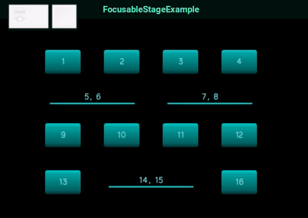

# Focusable Stage Example #

This example is a libGDX demo that shows the Focusable Stage in action

### Usage ###

 1. Copy the [`FocusableStage` file](https://github.com/Spikatrix/Focusable-Stage-Example/blob/master/core/src/com/example/focusablestage/FocusableStage.java) into your project and import it
 2. Replace `Stage` with `FocusableStage`:
 
     `Stage stage = new Stage(viewport);` --> `FocusableStage stage = new FocusableStage(viewport);`
 3. Add all `Actor`s that you wish to have focus capabilities, similar to how you would add `Actor`s into a `Table`:
 
        stage.addFocusableActor(new TextButton("button 1", skin), 3); // 3 signifies the colspan of the Actor; default is 1 if you omit it
        stage.addFocusableActor(new TextButton("button 2", skin));    // Uses 1 colspan because the second argument was omitted
        stage.row(); // Used to signify the end of a row just like `Table`s
        
 4. Optionally, use `setFocusedActor` to focus a particular `Actor`:
  
        stage.setFocusedActor(textbutton3);
        
 ### Supported keyboard inputs ###
 
  - `TAB`               for focusing the next Actor
  - `SHIFT` + `TAB`     for focusing the previous Actor
  - `LEFT`              for focusing the previous Actor
  - `RIGHT`             for focusing the next Actor
  - `UP`                for focusing the above Actor
  - `DOWN`              for focusing the below Actor
  - `Enter` or `Space`  for pressing the currently focused Actor
  
provided the currently focused actor is not busy
  

This example uses the [neon-ui skin](https://ray3k.wordpress.com/neon-ui-skin-for-libgdx/) made by [Raymond "Raeleus" Buckley](https://github.com/raeleus) using [Skin Composer](https://github.com/raeleus/skin-composer) which is licenced under [CC BY 4.0](https://creativecommons.org/licenses/by/4.0/)
